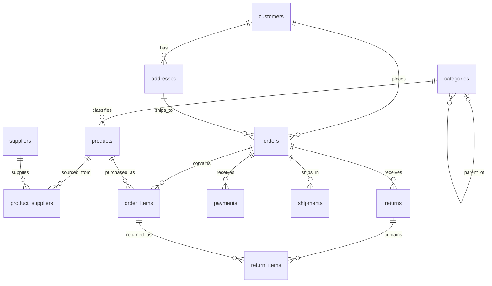

# Retail database

The schema contains 12 related tables and supports joins, anti-joins, conditional
aggregation, correlated subqueries, window functions, recursive category traversal,
cohort analysis, and independent aggregation of one-to-many relationships.

## Entity relationships



Foreign keys bind an order's shipping address to that order's customer. Composite
foreign keys also prevent a return item from referring to an item on another order.
`order_id` in `return_items` supports those constraints; it is intentionally redundant.
Use IDs for grouping: customer and product names are not unique.

## Business rules

- Dates use `YYYY-MM-DD`; use start-inclusive, end-exclusive ranges.
- Monetary amounts are integer USD cents. Historical sales use the order item's
  stored price, not the product's current price.
- `discount_cents` is the entire line's discount. A line's gross merchandise sales
  are `quantity * unit_price_cents - discount_cents`.
- Gross merchandise revenue covers completed orders, after discounts and excluding
  shipping. Cancelled and processing orders do not contribute to sales.
- Net merchandise revenue subtracts refunds from **approved** returns. Refunds are
  attributed to the original order date even when the return occurs later.
- Successful payment collection includes shipping. It is a separate metric from
  merchandise revenue, and uses `paid_at` for payment-period questions.
- Returns describe credited refunds; a separate cash refund transaction ledger is
  outside this schema. Pending and rejected returns never reduce net sales.
- There can be multiple payment attempts and multiple successful payments per order.
- Shipments are associated with whole orders; there is no mapping of individual
  products to shipments. Questions cannot infer which product shipped in which parcel.
- A delivered shipment is late if `delivered_at > promised_at`. Undelivered shipments
  have NULL `delivered_at` and do not count as late deliveries. An order has a late
  delivery when at least one of its delivered shipments is late.
- Products are directly assigned to one category. Descendants count only when a
  question explicitly requests the category subtree or root category.
- `product_suppliers` lists eligible suppliers, not the supplier of a historical
  sale. Supplier sales questions explicitly describe attributing product revenue
  to eligible suppliers; this data cannot establish actual procurement profit.
- Ratios use floating-point division, with NULL for an undefined denominator.
- Questions specify output columns, ordering, tie-breaking, and zero-activity inclusion.

## Three fixtures

`python -m src.setup` builds `retail_a.sqlite`, `retail_b.sqlite`, and `retail_c.sqlite`
with seeds 17, 43, and 97. Each includes 80 customers, 48 products, 480 orders and
1,200 order lines. Their relationships are consistent, while prices, dates, quantities,
supplier assignments, and customer/order associations vary.

Deliberate edge cases include zero-activity customers, a customer without an address,
unsold products, products without suppliers, duplicate names, partial approved and
unapproved returns, split payments, failed payment attempts, split shipments, NULL
delivery dates, quarter boundaries, a three-level category tree, and supplier coverage
that distinguishes `every product` from `some product`.

Generated data is synthetic, with no real customer information. Three fixtures improve
discrimination but do not prove SQL equivalence on every possible database.

## Managing and exploring the database

Use [DB Browser for SQLite](https://sqlitebrowser.org/) as an optional visual client.
Open `data/databases/retail_a.sqlite`; the **Database Structure**, **Browse Data**, and
**Execute SQL** tabs let you inspect the schema, inspect records, and try queries.
The SQLite files also work with DBeaver's SQLite connection if you already use it.

For experiments that change records, make a scratch copy first. Benchmark fixture
hashes are checked before runs so GUI edits cannot silently change the comparison.
Change `data/schema.sql` or `src/seed.py` to make reproducible changes, then rebuild:

```powershell
python -m src.setup --force
python -m src.validate
```

A dependency-free CLI is included:

```powershell
python -m src.inspect_db
python -m src.inspect_db --sql "SELECT status, COUNT(*) AS orders FROM orders GROUP BY status"
```
